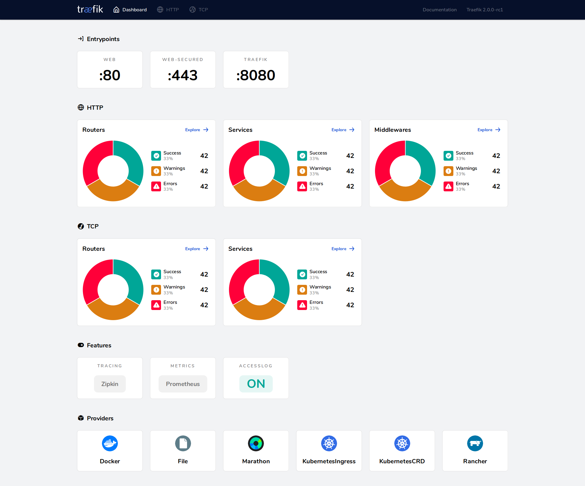

## Overview

Imagine that you have deployed a bunch of microservices with the help of an orchestrator (like Swarm or Kubernetes) or a service registry (like etcd or consul).
Now you want users to access these microservices, and you need a reverse proxy.

Traditional reverse-proxies require that you configure _each_ route that will connect paths and subdomains to _each_ microservice. 
In an environment where you add, remove, kill, upgrade, or scale your services _many_ times a day, the task of keeping the routes up to date becomes tedious. 

**This is when Traefik can help you!**

Traefik listens to your service registry/orchestrator API and instantly generates the routes so your microservices are connected to the outside world -- without further intervention from your part. 

**Run Traefik and let it do the work for you!** 
_(But if you'd rather configure some of your routes manually, Traefik supports that too!)_


## Features

- Continuously updates its configuration (No restarts!)
- Supports multiple load balancing algorithms
- Provides HTTPS to your microservices by leveraging [Let's Encrypt](https://letsencrypt.org)  (wildcard certificates support)
- Circuit breakers, retry
- See the magic through its clean web UI
- Websocket, HTTP/2, GRPC ready
- Provides metrics (Rest, Prometheus, Datadog, Statsd, InfluxDB)
- Keeps access logs (JSON, CLF)
- Fast
- Exposes a Rest API
- Packaged as a single binary file (made with :heart: with go) and available as a [tiny](https://microbadger.com/images/traefik) [official](https://hub.docker.com/r/_/traefik/) docker image


## Supported Backends

- [Kubernetes](https://doc.traefik.io/traefik/providers/kubernetes-crd/)

## Quickstart

To get your hands on Traefik, you can use the [5-Minute Quickstart](https://doc.traefik.io/traefik/getting-started/quick-start/) in our documentation (you will need Docker).

## Launching and Running the Container

Build the container 

```
docker build -t traefik-debug .
```

Test running the container locally by volume mounting a sample config

```
docker run --rm -p 8080:8080 -v $PWD/config/traefik_example.toml:/etc/traefik/traefik.toml traefik-debug
```

You should see the Traefik dashboard at localhost:8080

## Using the Container

This container has a default configuration in /etc/traefik/traefik.toml
One of the config entry contains necessary entryPoint to enable pinging the instance https://doc.traefik.io/traefik/operations/ping/
which is then required for the healthcheck.  If you volume mount this config please be sure to add the Ping related config back in

## Web UI

You can access the simple HTML frontend of Traefik.



## Documentation

You can find the complete documentation of Traefik v2 at [https://doc.traefik.io/traefik/](https://doc.traefik.io/traefik/).

